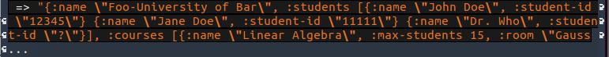
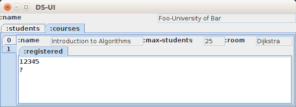

# DSUI
A Clojure tool for displaying arbitrary, nested data structures as a read-only, form-based UI. DSUI stands for "Data Structure User Interface".

## Motivation

1. Being tired of writing UI code.

1. Avoiding this:  


1. And getting this instead:  


## Usage

### Installing the library

Via deps:

```clojure
{:deps {org.clojars.azel4231/dsui {:mvn/version "0.1.0"}}}
```

Via lein:

```clojure
:dependencies [[org.clojars.azel4231/dsui "0.1.0"]]
```

Via maven:

```
<dependency>
  <groupId>org.clojars.azel4231</groupId>
  <artifactId>dsui</artifactId>
  <version>0.1.0</version>
</dependency>
```

### Calling the library 

```clojure
(require '[dsui.swing :as d])
```

Display data as a form-based UI:

```clojure
(d/dsui any-data)
```

Show how data conforms to a spec. Useful for specs with choices (via s/or) or labeled values (vis s/cat). If the data does not conform, displays the explanation (explain-data) as a ui:

```clojure
(d/conform-ui ::any-spec any-data)
```

## Basic Features
Displays:
- maps as forms, nested data structures a tabbed panes
- sequential data (including vectors, lists and sets) as vertical tabbed panes with (0..n) as a title
- lists containing only scalar values as JLists
- Matrices (vector of vectors) as tables
- Lists of maps, that have the same keyset and contain scalar values only, as tables
- conformed data (labeled data) returned by specs as vertical tabbed panes with the label as a title. Thus DSUI can be also used to see how things conformed when writing specs

Does not support:
- a single scalar value

Not suited for:
- graph-like data
- large data-sets (generating the UI is currently eager)

## How it works
DSUI uses clojure.spec to "parse" an arbitrary data structure. The conformed data is used to generate the swing UI by calling a multimethod that polymorphically creates different types of UI elements.

More detailed explanations can be found <a href="https://feierabendprojekte.wordpress.com/2016/09/11/generating-ui-for-arbitrarily-nested-data-structures/">here</a> and <a href="https://feierabendprojekte.wordpress.com/2017/06/12/conforming-conformed-data/">here</a>

## Next Steps
- Decomplect processing pipeline: move parts that are agnostic of the UI framework into a separate step so they can be reused for other UI frameworks.
- Migrate to <a href="https://github.com/halgari/fn-fx">fn-fx</a>

## Distant Future
- Attach to atom and let DSUI "watch" changes
- Make UI editable (e.g. swap value to an atom)

## License
Distributed under the Eclipse Public License, the same as Clojure.
